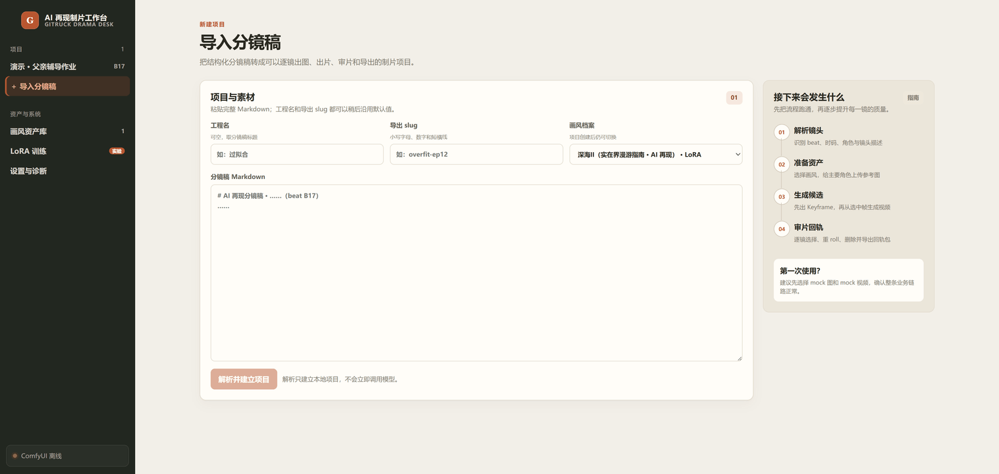
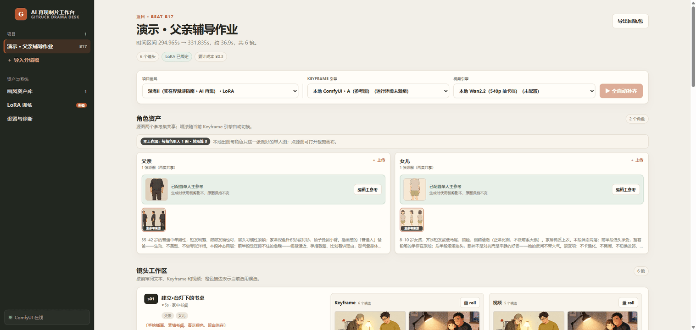
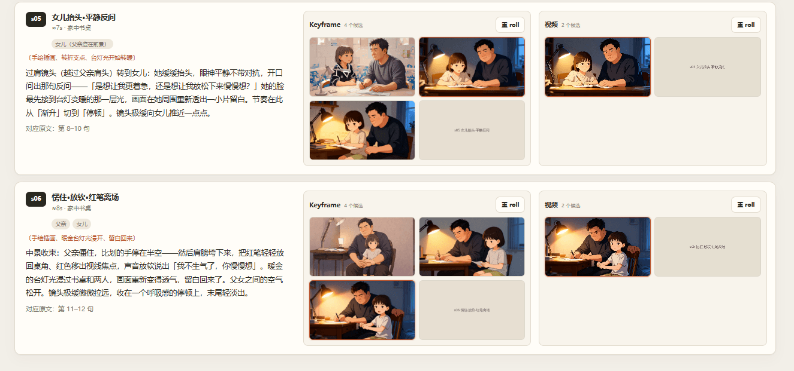
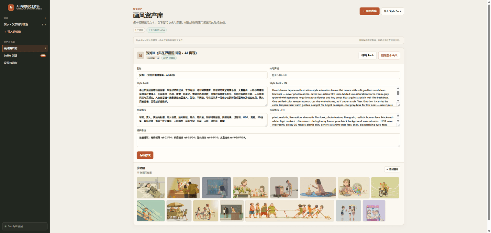
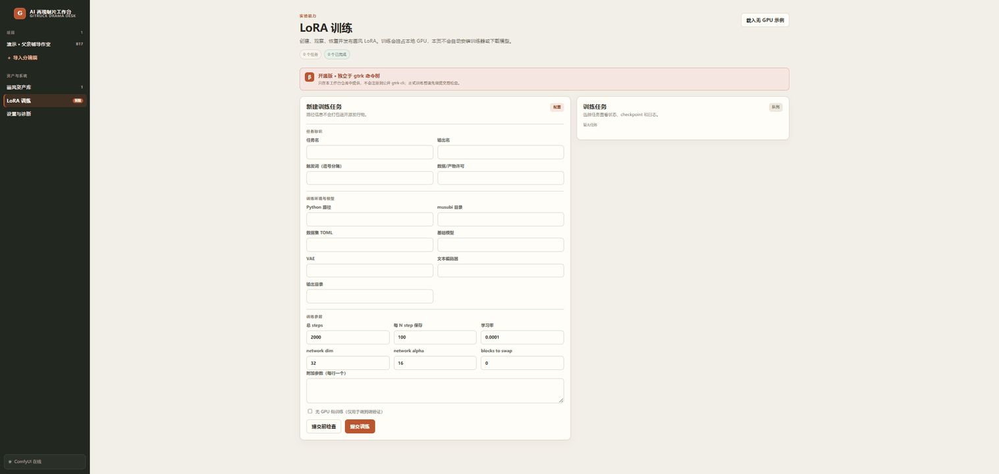
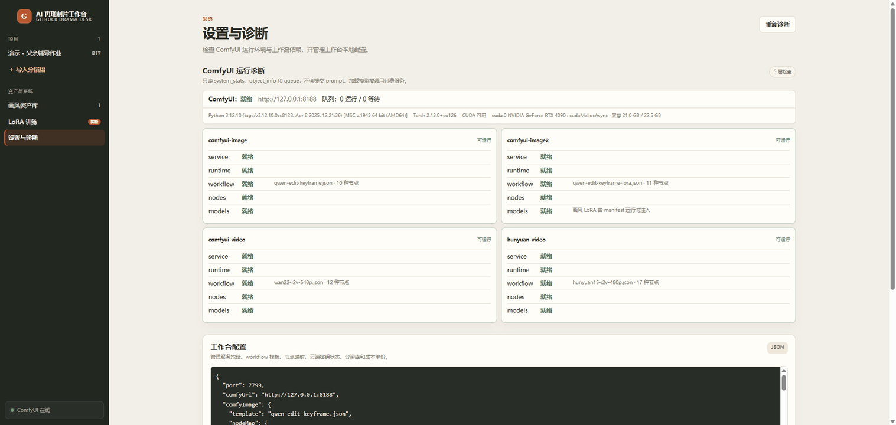

# ai-drama-desk · AI 再现制片工作台

> 把「分镜稿 md」低成本变成可回轨的视频片段 —— **本地开源模型出片产线：keyframe（参考图/LoRA 锁角色与画风）→ I2V 抽卡 → 导出 return-v1 命名的片段包，可拖回任意 NLE**。
>
> 本地 GPU 做重活、云端出口做备选、mock 引擎零模型演练全链路。数据即文件，删目录即删数据。

**🔗 配套教程：[AI 视频制片全流程与 LoRA 实践](https://hocassian.feishu.cn/docx/BVond4JbnoWVLnxaWMSckBpnnig)**（完整制片流程 · Agent 中使用 skills · LoRA 实战复盘 · 与 gtrk 工作流衔接）

```
分镜稿 md ──解析──▶ Shot IR ──每镜──▶ keyframe（参考图锁角色/画风）──▶ I2V 出片（540p 抽卡）
                                                                        │
        任意 NLE ◀── 手动拖回对齐 ◀── 导出回轨包（return-v1 命名 + ffprobe 实测时长）
```

---

## 界面一览

| | |
|:---:|:---:|
| <br>**导入分镜稿** · 粘贴分镜稿 md，解析成结构化制片项目 | <br>**项目工作区** · 角色资产（双参考集）+ 逐镜候选，引擎一键切换 |
| <br>**镜头工作区** · 每镜文本、Keyframe/视频候选，点击选用或重 roll | <br>**画风资产库** · Style Lock、负面栈、参考图与 LoRA 绑定 |
| <br>**LoRA 训练** · 提交前检查、后台训练、checkpoint 恢复与发布 | <br>**设置与诊断** · ComfyUI 五层就绪诊断，缺什么放哪里逐条点名 |

---

## 为什么用 ai-drama-desk

- **分镜稿进、片段包出**：粘贴一份分镜稿 md → 结构化成分镜卡片 → 逐镜出图、出片、抽卡挑选 → 一键导出带 manifest 的回轨包，文件名即回轨定位（`<slug>-<beatId>-s<n>.mp4`）。
- **本地开源模型的低成本产线**：Qwen-Image-Edit 出 keyframe 锁角色一致性，Wan2.2 / HunyuanVideo 1.5 蒸馏档 I2V 出片——24G 级显卡（如 4090）单机可跑；不想等本地 GPU 时切云端出口（PixMind / fal / 火山方舟）。
- **没有显卡也能用**：一把 PixMind Key 即可全云出片，默认线路 MiniMax H3 Eco **自带原生 32kHz 立体声**（480p $0.040/秒），拿到与本地 H3 档同样的音画同步能力，无需 40 GB 权重与 24 GB 显存。
- **画风是资产，不是设定项**：画风档案（Style Lock + 负面栈 + 锚定参考图 + 可选 LoRA）独立建档、可导入导出风格包、可绑定你自己训练的 LoRA；换栏目 = 换画风档案，管线不变。
- **零门槛试跑**：mock 引擎无 GPU、无模型、无云 Key（仅需本地 ffmpeg）即可端到端演练「导入 → 出图 → 出片 → 导出」，先跑通流程再逐步接真引擎。
- **为 agent 而生**：Web UI 与 CLI 都是同一 HTTP API 的客户端；配套 skill 装进 Claude Code / Codex / Cursor 等 Agent 后，一句「把这份分镜稿投进工作台出片」即可驱动闭环。playbook 见 [`AGENT.md`](./AGENT.md)。

## 功能

| | 能力 | 做什么 |
|---|---|---|
| 📥 | 分镜稿导入 | 粘贴分镜稿 md → 解析成分镜卡片（beat id / 每镜秒数 / 场景 / 角色 / 描述全结构化），解析告警逐条提示，也可直接投喂 `shots.json` |
| 🎭 | 角色参考图 | 每角色上传设定原图；本地引擎走「单人单图集」（裁剪画布拖框裁主参考），多图引擎走「多图直喂集」（勾选墙 + 预算分配） |
| 🧑‍🎨 | 人设图生成 | 工作台内直出角色参考图：`single` 单人立绘 / `turnaround` 三视图设定表；现成开源模型零前置兜底（无画风/锚图/LoRA 也能出），产物即刻进双参考集 |
| 🖼️ | Keyframe 出图 | 每镜出首帧，单卡重 roll、点击选用；引擎可选本地 ComfyUI（参考图档 / LoRA 档）、云端、mock |
| 🎞️ | I2V 出片 | 选中 keyframe → 图生视频；本地 ComfyUI 540p 抽卡档 / H3 带音轨档 / 480p 蒸馏档，或云端出口 |
| 🤖 | 全自动补齐 | 缺啥补啥：无图先出图再接力出片；本地 GPU 车道串行、云车道小并发 |
| 📦 | 导出回轨包 | `<slug>-<beatId>-s<n>.mp4` + manifest（ffprobe 实测时长 vs 建议秒数差值、音轨状态、成本台账），拖回任意 NLE 对齐 |
| 🎨 | 画风资产 | 画风档案建/改/删、风格包导入导出、LoRA 绑定；CLI `style` 子命令同能力 |
| 🧪 | LoRA 训练 | 提交前检查 → 后台训练 → checkpoint 恢复 → 发布绑定到画风；CLI `lora` 子命令同能力 |
| 🩺 | ComfyUI 诊断 | service / runtime / workflow / nodes / models 五层只读诊断，缺什么、放哪里逐条点名 |

---

## 安装 & 快速上手

### a) 工作台本体（第一步：mock 零依赖跑通全链路）

需要 [Bun](https://bun.sh) ≥ 1.x；mock 演练与导出实测需本地可用的 `ffmpeg`（在 PATH 中）。

```bash
git clone https://github.com/Gitruck/ai-drama-desk.git
cd ai-drama-desk
bun install
bun run start        # 构建前端 + 起服务，打开 http://127.0.0.1:7799
```

**新手第一步不需要 GPU、模型或任何云 Key**：新建项目 → 粘贴一份分镜稿 md（最小结构见下文「输入契约」）→ 出图/出片引擎都选 **mock** → 全自动补齐 → 导出。跑通这一圈，你就理解了整个工作台；之后再按需接 ComfyUI（本地出片）或云端出口。

CLI 与服务同源（源码形态运行）：

```bash
bun run cli -- --help
bun run cli -- health --json
```

### b) ComfyUI 本地部署（本地出图/出片）

本地引擎经 [ComfyUI](https://github.com/comfyanonymous/ComfyUI) 的 HTTP API 驱动（默认 `http://127.0.0.1:8188`）。从官方仓库或官方 Desktop/便携包获取并安装；源码方式概略：

```bash
git clone https://github.com/comfyanonymous/ComfyUI.git
cd ComfyUI
python -m venv venv           # 建议独立 venv（或用官方推荐的安装方式）
# 激活 venv 后，先按下方「PyTorch 的 CUDA 构建」装好 torch，再装 ComfyUI 依赖
pip install -r requirements.txt
python main.py                # 默认监听 127.0.0.1:8188
```

#### ⚠️ PyTorch 的 CUDA 构建：装错不报错，只是悄悄变慢

下表的权重全是 **fp8_scaled / 量化档**。ComfyUI 用 comfy-kitchen 的优化 CUDA 算子跑这类权重，而它有一道硬门槛——`comfy/quant_ops.py` 里判 `torch.version.cuda < 13` 就**直接关掉整个 CUDA 后端**，只打一行 warning，然后静默降级到 eager 反量化路径：

```python
if cuda_version < (13,):
    ck.registry.disable("cuda")
    logging.warning("WARNING: You need pytorch with cu130 or higher to use optimized CUDA operations.")
```

**不报错、能出图、只是慢**，所以极易被忽略。RTX 4090（sm_89）上实测 4096³ linear 三条路径：优化 CUDA kernel 0.32 ms、纯 bf16 0.84 ms、eager 回退 **1.81 ms**——也就是说 CUDA 构建装错时，量化权重比根本不量化还慢一倍多。20 系及以上显卡都受影响。

装 PyTorch 时显式指定 cu130（或更高）的索引：

```bash
pip install --index-url https://download.pytorch.org/whl/cu130 torch torchvision torchaudio
```

装完自检两条：

```bash
python -c "import torch; print(torch.version.cuda)"   # 应为 13.x，不是 12.x
python main.py                                        # 启动日志应出现 Found comfy_kitchen backend cuda: ...
                                                      # 且不应出现上面那句 cu130 warning
```

> 驱动只要满足 CUDA 13 的最低版本即可，**不需要**为此重装显卡驱动。若因故只能停在 cu12x，就改用非量化或 `fp8_scaled` 以外的权重档，别在 cu12x 上跑量化档白白挨慢。

#### 模型目录放哪

模型走分层加载，权重读取在出片热路径上。**放本机 NVMe，别放机械盘、更别放 SMB/NFS 网络盘**（网络延迟会把逐层换页拖成不可用）。若系统盘空间不够，用 ComfyUI 根目录的 `extra_model_paths.yaml`（从 `.example` 复制改名）把 `models/` 指到另一块本地盘：

```yaml
mypaths:
  base_path: F:/ai-models/comfyui
  diffusion_models: diffusion_models/
  text_encoders: text_encoders/
  vae: vae/
  loras: loras/
```

它是 **append 不是替换**——原有 `models/` 下的文件照常可见，两处内容合并进同一个下拉。

工作台「设置」页的 ComfyUI 诊断会分层报告缺什么（插件节点 / 模型文件），按提示补齐即可。ComfyUI 未装或未启动时状态栏显示离线，不影响 mock / 云端出口。

> **许可边界**：ComfyUI 为 GPL-3.0 项目。本仓不包含、不派生其任何代码，仅通过 HTTP API 与本机运行的 ComfyUI 实例通信。

### c) 模型下载清单（自行从原始发布方获取）

> **本仓不分发任何模型权重。** 下表列出内置 workflow 模板实际引用的权重文件；请自行从**原始发布方**（模型官方仓库 / 官方 Hugging Face 组织）下载，并**自行核对各自的许可条款**——社区蒸馏版、加速版（lightning / distilled）尤其要确认再分发与商用条款。fp8 全家桶按 24G 级显存（如 RTX 4090）选型。
>
> **HunyuanVideo 1.5 地域提示**：混元系列权重受腾讯社区许可（Tencent Community License）约束，许可条款对部分地域（如欧盟、英国、韩国）有排除性规定，下载使用前请自行确认适用性。

放入 ComfyUI 安装目录的 `models/` 对应子目录，文件名以模板引用为准（下载后如文件名不同，重命名或改模板均可）：

**Keyframe 出图 · Qwen-Image-Edit-2511（`qwen-edit-keyframe.json` / `qwen-edit-keyframe-lora.json`）**

| 权重文件 | 落位子目录 | 说明 |
|---|---|---|
| `qwen_image_edit_2511_fp8_e4m3fn_scaled_lightning_comfyui_4steps_v1.0.safetensors` | `models/diffusion_models` | Qwen-Image-Edit-2511 fp8 · 4 步 lightning 加速版 |
| `qwen_2.5_vl_7b_fp8_scaled.safetensors` | `models/text_encoders` | Qwen2.5-VL 7B 文本编码器 fp8 |
| `qwen_image_vae.safetensors` | `models/vae` | Qwen-Image VAE |
| 你自己的画风 LoRA（B 档可选） | `models/loras` | 模板中的 LoRA 文件名仅为示例占位；用 LoRA 训练页发布绑定，或在画风档案 manifest 里填相对路径 |

**I2V 出片 · Wan2.2 540p 抽卡档（`wan22-i2v-540p.json`）**

| 权重文件 | 落位子目录 | 说明 |
|---|---|---|
| `wan2.2_i2v_high_noise_14B_fp8_scaled.safetensors` | `models/diffusion_models` | Wan2.2 I2V A14B 高噪模型 fp8 |
| `wan2.2_i2v_low_noise_14B_fp8_scaled.safetensors` | `models/diffusion_models` | Wan2.2 I2V A14B 低噪模型 fp8 |
| `wan2.2_i2v_lightning_high_noise.safetensors` | `models/loras` | Wan2.2-Lightning 4 步蒸馏 LoRA（高噪，社区加速版、许可自查） |
| `wan2.2_i2v_lightning_low_noise.safetensors` | `models/loras` | Wan2.2-Lightning 4 步蒸馏 LoRA（低噪，社区加速版、许可自查） |
| `umt5_xxl_fp8_e4m3fn_scaled.safetensors` | `models/text_encoders` | UMT5-XXL 文本编码器 fp8 |
| `wan_2.1_vae.safetensors` | `models/vae` | Wan 2.1 VAE（2.2 沿用） |

**I2V 出片 · MiniMax H3 4 步 Turbo（`minimax-h3-i2v-4step.json`）**

> 需 **ComfyUI ≥ 0.30.0**（H3 原生节点自该版起提供）。前四个文件来自 `Comfy-Org/MiniMax-H3`，Turbo LoRA 来自 `joyfox/MiniMax-H3-Turbo`。
> **底模选 pruned 档时 LoRA 必须配套**：剪枝版把时间条件层换成了 8 维曲线基（`adaln_proj [96768, 8]`），而多数 Turbo LoRA 是按非剪枝的 2688 维训练的，形状对不上会被 ComfyUI 静默跳过（只打 `WARNING SHAPE MISMATCH`，照常出片但没有加速效果）。下表这个是在剪枝底模上原生蒸馏的。
> **地域提示**：H3 权重受 MiniMax H3 Community License 约束，排除欧盟 / 英国 / 韩国 / 美国；年营收超 2000 万美元需另行书面授权；商用产品界面须显著展示 "MiniMax H3" 字样。下载使用前请自行确认适用性。

| 权重文件 | 落位子目录 | 说明 |
|---|---|---|
| `minimax_h3_fl2va_pruned_int8_convrot.safetensors` | `models/diffusion_models` | H3-Base FL2VA 剪枝 int8（约 19.5 GiB）。**需 PyTorch cu130**，否则退回 eager 反而更慢，见上文 |
| `qwen3vl_32b_minimax_h3_nvfp4_awq.safetensors` | `models/text_encoders` | Qwen3-VL-32B 文本编码器 NVFP4（约 14.6 GiB）。sm_89 无原生 fp4 但可用，走软件反量化，整层开销约 +8% |
| `minimax_h3_video_vae_fp16.safetensors` | `models/vae` | H3 视频 VAE |
| `minimax_h3_audio_vae_fp32.safetensors` | `models/vae` | H3 音频 VAE。**缺它就没有音轨** |
| `minimax_h3_fl2va_4step_lora.safetensors` | `models/loras` | 4 步 Turbo LoRA（在剪枝底模上原生蒸馏）。不想要加速就把模板里的 `LoraLoaderModelOnly` 摘掉、步数改回 20、采样器换 `res_multistep` |

**I2V 出片 · MiniMax H3 成片档（`minimax-h3-i2v-final.json`）**

> 底模、文本编码器、双 VAE 与上面 4 步档**逐项相同**（已有就不用再下）；成片档只额外多一个加速 LoRA。
> 配方是 12 步 + `MiniMaxH3SigmaShift(6.0 / 3.0)` + 该 LoRA @0.75，全写死在模板图里。
> 上面那条「剪枝底模 × LoRA 形状必须配套」的警示同样适用：形状不配是静默失效（只打 `WARNING SHAPE MISMATCH`，照常出片但没有加速）。判据看 s/步，不是「能不能出片」。

| 权重文件 | 落位子目录 | 说明 |
|---|---|---|
| `minimax_h3_fl2v_turbo_4step_v1.0_768p_comfyui_bf16.safetensors` | `models/loras` | 成片档加速 LoRA（lightx2v 系社区蒸馏产物）。**本仓不分发该权重**，再分发与商用条款请自行确认。不想用就把模板里的 `LoraLoaderModelOnly` 摘掉并相应调步数 |

> **音轨关不掉，但导出可以剥。** H3 的视频与音频 latent 打包在同一个 `NestedTensor` 里联合去噪，节点上没有关音频的入参——出片必带原生 32kHz 立体声。垫在口播下面会叠声，所以导出回轨包时**默认剥离**（配置项 `exportKeepAudio`，默认 `false`）。剥离走 ffmpeg 流拷贝，不重编码、视频流逐字节不变；项目候选里的原片仍带音轨，改开关重导即可找回，不必重新出片。manifest 会逐条标注音轨状态（`有` / `已剥离` / `无`）。

**I2V 出片 · HunyuanVideo 1.5 480p 蒸馏档（`hunyuan15-i2v-480p.json`）**

| 权重文件 | 落位子目录 | 说明 |
|---|---|---|
| `hunyuanvideo1.5_480p_i2v_step_distilled_fp8_scaled.safetensors` | `models/diffusion_models` | HunyuanVideo 1.5 480p I2V 步数蒸馏 fp8（腾讯社区许可，地域提示见上） |
| `qwen_2.5_vl_7b_fp8_scaled.safetensors` | `models/text_encoders` | 与 Qwen-Edit 共用同一文件 |
| `byt5_small_glyphxl_fp16.safetensors` | `models/text_encoders` | ByT5-small glyph 编码器 |
| `hunyuanvideo15_vae_fp16.safetensors` | `models/vae` | HunyuanVideo 1.5 VAE |
| `sigclip_vision_patch14_384.safetensors` | `models/clip_vision` | SigCLIP vision 编码器 |

### d) workflow 模板与节点映射（templates/）

工作台不猜你的 ComfyUI 装了什么节点：**你在 ComfyUI 里把 workflow 调通 →「工作流 → 导出(API)」存成 JSON 放进 `templates/` → 在工作台「设置」登记模板文件名和节点映射（nodeMap）**。仓内自带上述三套模板开箱可用；自定义模板、nodeMap 字段说明与占位图注意事项见 [templates/README.md](templates/README.md)。

### e) 云端出口（可选）

**没有本地 GPU 也能用**：全部四条云端出口都不需要本机显卡与模型权重，只要一把 API Key。不想等本地 GPU、或某镜动作复杂本地抽不出来时，也可临时切云端。Key 填在 `data/config.json`（字段模板见仓根 [config.example.json](config.example.json)，首次启动会自动生成默认配置）：

| 出口 | 配置字段 | 说明 |
|---|---|---|
| **PixMind（I2V 出片）** | `pixmindKey` | 默认 `minimax-h3-eco`，**出片自带原生 32kHz 立体声**——本地跑不动 H3 权重（约 40.5 GB + 24GB 显存）的用户走这条即可拿到同样的音画同步能力。默认 480p（$0.040/秒），可切 720p |
| **PixMind（keyframe 出图）** | `pixmindKey` | 默认 `nano-banana-2-eco`，多图直喂（预算 14 张）；与出片共用同一把 Key |
| fal.ai（I2V 出片） | `falKey` | 默认端点 Wan2.2 A14B I2V；出的是哑片 |
| 火山方舟 Seedream（keyframe 出图） | `arkApiKey` | 多图直喂参考集（预算 10 张），适合直接吃三视图原图 |

云端生成一律计入成本台账，导出时报累计成本。密钥只存本地 `data/config.json`（该目录不进 Git）；API 对外只返回「已配置」布尔值，不回显密钥。

#### PixMind API Key 怎么拿

1. 到 [pixmind.io](https://www.pixmind.io/) 注册登录（支持 Google 登录）。
2. 进 [API Key 控制台](https://www.pixmind.io/api-platform/dashboard/keys) → **Create API Key**，只勾这条线路需要的图片 / 视频权限（最小权限原则）。Key 形如 `sk_live_…`，**只在创建时完整显示一次**，请立刻存好。
3. 建议在控制台给单把 Key 配预算与限流上限；开发与生产各用一把，泄露即轮换。
4. 到 [Billing](https://www.pixmind.io/api-platform/dashboard/billing) 充值（API 按量计费，与站内 Studio 积分分开结算）。
5. 把 Key 填进工作台「设置与诊断」页配置 JSON 的 `pixmindKey`，保存后出图/出片下拉里的两个 PixMind 选项即可用。

> 想先验 Key 是否可用，可在模型页的 Playground 直接跑一条（PixMind 声明不保存 Playground 里输入的 Key）。切换模型只需改 `pixmindVideoModel` / `pixmindImageModel`——同一套接入可切该平台全目录线路，无需改代码。

---

## 输入契约：分镜稿 md

上游输入是一份**分镜稿 Markdown**——不预设由谁产出：手写、任何 LLM、或 gtrk 生态的 `/gtrk-ai-drama` skill（[@gitruck/cli](https://www.npmjs.com/package/@gitruck/cli)）产的分镜稿都可直接投喂。解析器容错优先，解析不出的字段可在 UI 手工补齐，也可直接投喂 `shots.json` 跳过解析。最小结构骨架（虚构题材示例）：

```markdown
# 灯塔与机械信鸽（beat B02）

- 区间总时长：track_st 12.000 → track_ed 48.500 ≈ 36.5 秒
- 建议分镜数：2

## 一、中文稿（喂图生视频）

### ① 视觉基调（Style Lock）
> 手绘插画风，低饱和暖灰底色，黄铜与雾蓝点缀……（你的画风锁定词）
> 禁忌：写实照片感、文字水印

### ② 故事背景
十九世纪末的孤岛灯塔，老守塔人与一只机械信鸽相依为命。

### ③ 角色
#### 守塔人（约六十岁，白胡须，油布雨衣）
身形佝偻但眼神明亮，常年握灯柄的右手指节粗大。

### ④ 分镜
#### 分镜 01 · 灯塔远景 ｜建议 ≈6s ｜场景：暴风雨夜的海岸 ｜角色：无 ｜对应原文：那年冬天…
〔冷雾蓝基调〕暴风雨中的灯塔剪影，光束缓慢扫过翻涌的海面。

#### 分镜 02 · 守塔人上楼 ｜建议 ≈5s ｜场景：灯塔旋梯 ｜角色：守塔人
守塔人提灯拾级而上，影子在弧形墙面拉长。

### ⑤ 原文文稿
那年冬天，灯塔的光第一次为一只鸽子亮起……

## 二、English Storyboard

### ① Style Lock
> Hand-drawn illustration, desaturated warm grey palette...

### ④ Shots
#### Shot 01 · Lighthouse wide ｜≈6s
[Cold misty blue tone] Silhouette of the lighthouse in a storm...
```

要点：标题带 `（beat BXX）` 供导出命名；①–⑤ 区块骨架（① 视觉基调 / ② 故事背景 / ③ 角色 / ④ 分镜 / ⑤ 原文文稿）；每镜一行分镜头（`｜` 分隔建议秒数 / 段 / 场景 / 角色 / 对应原文），描述行首可带 `〔视觉基调前缀〕`；英文块可选、按 Shot 序号回填。

## 工作流

1. **导入**：粘贴分镜稿 md → 解析成分镜卡片，解析告警逐条提示。
2. **角色参考图**：每角色上传设定原图（只传一次，各参考集共享）。本地 ComfyUI A/B 档走**单人单图集**——裁剪画布上拖框裁出只含该角色的主参考；Seedream 走**多图直喂集**——默认全选、可点选排除。详见[使用手册](docs/使用手册.md)。
3. **出图**：每镜 keyframe，单卡重 roll、点击选用。
4. **出片**：选中 keyframe → I2V。出口：本地 ComfyUI（540p 抽卡档 / H3 带音轨档 / 480p 蒸馏档）/ PixMind 云（H3 Eco 带音轨）/ fal 云 / mock。
5. **全自动补齐**：缺啥补啥（无图先出图再接力出片），本地 GPU 车道串行、云车道小并发。
6. **导出回轨**：`<slug>-<beatId>-s<n>.mp4` 落 `exports/aidrama/`，manifest 含 ffprobe 实测时长 vs 建议秒数差值 + 成本台账。把满意的片段**拖回你的任意 NLE**（剪映 / Premiere / 达芬奇…）按 beat 区间对齐。

## 生成引擎

| 引擎 | 类型 | 依赖 | 说明 |
|---|---|---|---|
| `mock-image` / `mock-video` | 出图 / 出片 | 本地 ffmpeg | 占位图 / 缓推占位片，零模型零 Key 演练全链路 |
| `comfyui-image`（A 档） | 出图 | 本地 ComfyUI | Qwen-Image-Edit-2511，角色参考图锁一致性 |
| `comfyui-image2`（B 档） | 出图 | 本地 ComfyUI + 画风 LoRA | 画风由 LoRA 承担，需当前画风绑定 LoRA manifest |
| `seedream-image` | 出图 | `arkApiKey` | 火山方舟 Seedream，多图直喂（预算 10 张） |
| `pixmind-image` | 出图 | `pixmindKey` | PixMind 云出口，默认 Nano Banana 2 Eco，多图直喂（预算 14 张）；**零本地依赖** |
| `comfyui-video` | 出片 | 本地 ComfyUI | Wan2.2 I2V 540p 抽卡档 |
| `h3-video` | 出片 | 本地 ComfyUI ≥0.30 | MiniMax H3 I2V · 抽卡档，4 步 Turbo；**出片自带原生 32kHz 立体声**，固定 24fps |
| `h3-video-final` | 出片 | 本地 ComfyUI ≥0.30 | MiniMax H3 I2V · 成片档，12 步 + SigmaShift；同样带原生立体声。与抽卡档是**两个独立出口**，切档不承诺同 seed 复现同一条，只是投入更多算力。5 秒片约 2 倍耗时（走出口实测约 88 秒）；15 秒长镜超线性，约 5 分钟，别拿 5 秒片的数线性外推 |
| `hunyuan-video` | 出片 | 本地 ComfyUI | HunyuanVideo 1.5 480p 步数蒸馏档 |
| `fal-video` | 出片 | `falKey` | fal.ai Wan2.2 A14B I2V，高动作镜头或赶工 |
| `pixmind-video` | 出片 | `pixmindKey` | PixMind 云出口，默认 MiniMax H3 Eco，4–15 秒、480p/720p；**出片自带原生 32kHz 立体声、零本地依赖**，本地跑不动 H3 时走这条 |

## 画风资产

画风档案 = Style Lock 文字锁 + 负面栈 + 锚定参考图 + 可选 LoRA 绑定。**从风格包导入，或自建画风**：

```bash
bun run cli -- style create --file ./profile.json          # 自建
bun run cli -- style import ./my-style.style-pack.json     # 导入风格包
bun run cli -- style export my-style --out ./pack.json     # 导出分享（默认不含参考图与权重）
```

配合 LoRA 训练页（或 `bun run cli -- lora ...`）可把你自己的画风训成 LoRA 并发布绑定到画风档案，B 档出图即用。数据集原则、验收顺序见[使用手册](docs/使用手册.md)。

## 数据即文件

`data/` 下全部是可手工翻的文件（项目 / 画风档案 / 产物 / LoRA 任务日志），删目录即删数据；`data/config.json` 是唯一配置文件。该目录不进 Git。

## 给 AI Agent 用

Web UI 与 CLI 都是同一 HTTP API（`http://127.0.0.1:7799/api/v1`）的客户端，agent 可直接驱动全链路。仓内自带 skill 正本（`skills/gitruck-ai-drama-desk/`），一条命令装进本机检测到的 Agent（Claude Code / Codex / Cursor / Gemini CLI 等）：

### 把已有项目交给 Agent

服务已经启动时，Agent 不需要知道工作台仓库位于哪个目录；只要拿到 **API 地址 + 项目 ID**，就能通过版本化 HTTP API 定位项目并继续调用角色参考图、出图、出片与导出接口。默认 API 地址是 `http://127.0.0.1:7799/api/v1`。

1. 在工作台左侧进入目标项目。
2. 在项目标题下方的元信息行找到 `项目 ID`，点击同一胶囊内的「复制」。
3. 把复制出的 ID 连同任务发给 Agent，例如：`请给项目 proj-ms1aq6nv 的「退伍士兵」生成人设图`。

Agent 的正确顺序是先请求 `GET /health`，再请求 `GET /projects/<id>` 校验项目，成功后直接走 HTTP API；不应为了接管已有项目搜索仓库。只有在服务尚未启动、需要修改仓库，或只能从源码运行 CLI 时，才需要提供明确的仓库路径。非默认服务地址通过 `GITRUCK_AI_DRAMA_DESK_URL` 指定；已安装独立 CLI 时也可直接使用，无需仓库 cwd。

### 安装工作台 skill

```bash
bun run cli -- skills install                      # 自动探测本机 Agent
bun run cli -- skills install --agents codex,cursor  # 只装指定宿主
bun run cli -- skills install --copy               # 不用链接，各宿主复制一份
```

统一正本落 `~/.agents/skills`，再链接（Windows 为 junction）到各 Agent 兼容目录；链接不可用时回退复制。装好后对 agent 说「把这份分镜稿投进工作台出片」，或显式 `/gitruck-ai-drama-desk style` / `/gitruck-ai-drama-desk lora` 驱动画风与训练管理。完整可移植 playbook 见 [`AGENT.md`](./AGENT.md)——任何 agent 读完即可驱动工作台，skill 只是薄壳。

## 声明

- **测试与开发规格为内部持有**：本仓公开源码与使用文档；测试套件与开发过程规格不随仓发布。
- **模型权重**：本仓不分发任何模型权重；请自行从原始发布方下载并核对各自许可（社区蒸馏 / 加速版尤其）。HunyuanVideo 1.5 权重受腾讯社区许可地域约束（如欧盟 / 英国 / 韩国排除），使用前自行确认。
- **ComfyUI**：GPL-3.0 项目，本仓仅经 HTTP API 集成，无代码派生。
- **许可**：本仓源码以 MIT 许可发布（见 [LICENSE](LICENSE)）。
